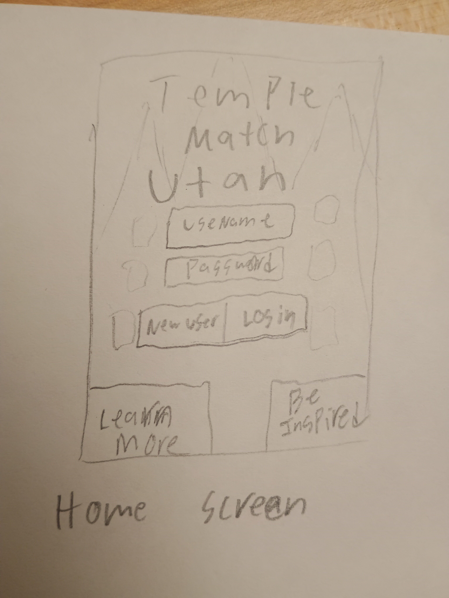
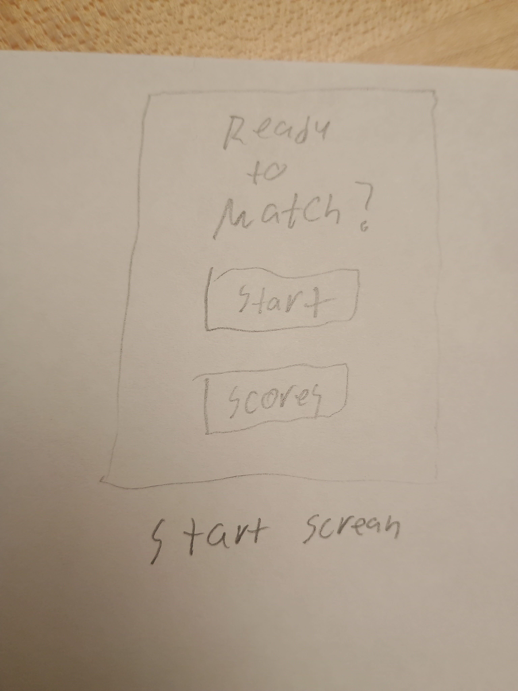
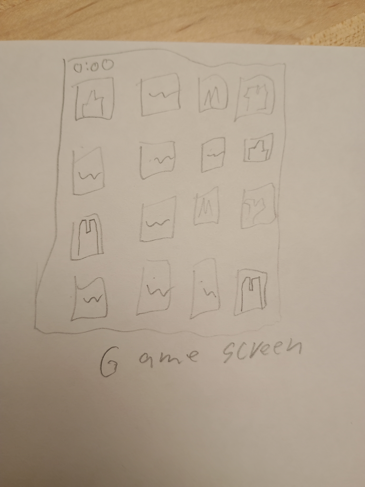
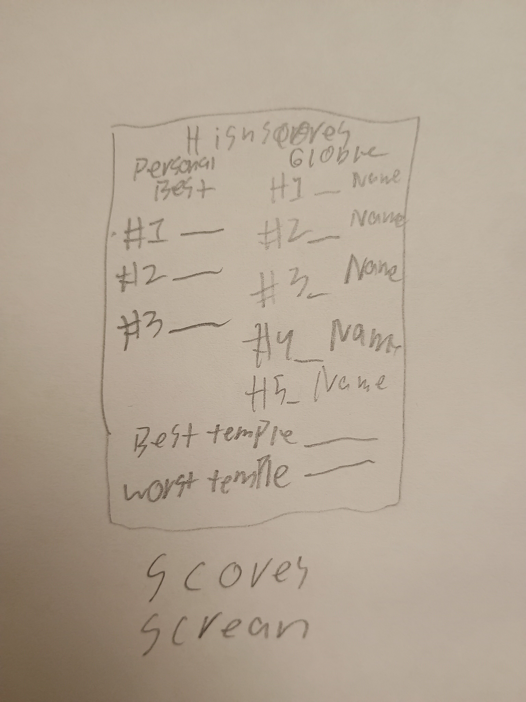

# [Temple Match Utah](https://templematch.click)

Temple Match is a web app designed to help you practice matching the different temples in Utah with their correct names. It provides a fun way to learn and allows you to compete against your friends. 

### Elevator pitch

Do you want to impress your friends? Or maybe you are like me and have accidentally gone to the wrong temple before. With over 30 temples in utah in a variety of different stages, there is a lot to remember. Temple Match Utah is here to help you learn and have fun while doing it. Improve your knowledge and compete for the high score. 

### Design

| 

These show the four main screens of my webapp. They will start at the home screen and can navigate to the start screen by logging in. After that they can go to the game screen or the scores screen 

### Key features

- Match photos of temples with their names
- Login to save your scores
- Atempt to ge the fastest score to make it onto the leader board
- Use the Be Inspired button to see an insprational scripture.
- See what temples you are best and worst at matching

### Technologies

I am going to use the required technologies in the following ways.

- **HTML** - Will be used for the structure of the 4 webpages.
- **CSS** - Will be used to make the pages look professional and hopefully the animation of the cards flipping over
- **React** - This is going to be used for the navigation buttons and possibly the cards flipping over
- **Service** - Going to call an API to get a random scripture to display there are two bible API on the list that was linked to. There is also an open scripture api I found but I don't know if that is compatible. Also we will need to retrieve user scores and data from the database
- **DB/Login** - Store the account info for each player and there data such as High scores and most missed and most correct matches 
- **WebSocket** - Sharing scoring data. if another player gets a Personal best or a High score it broadcasts it so everyone can celebrate! Also displaying the number of people currently on. (Not sure if this is websocket)
## 🚀 Specification Deliverable

> [!NOTE]
> Fill in this sections as the submission artifact for this deliverable. You can refer to this [example](https://github.com/webprogramming260/startup-example/blob/main/README.md) for inspiration.

For this deliverable I did the following. I checked the box `[x]` and added a description for things I completed.

- [X] Proper use of Markdown
- [X] A concise and compelling elevator pitch
- [X] Description of key features
- [X] Description of how you will use each technology
- [X] One or more rough sketches of your application. Images must be embedded in this file using Markdown image references.
## 🚀 AWS deliverable

For this deliverable I did the following. I checked the box `[x]` and added a description for things I completed.

- [x] **Server deployed and accessible with custom domain name** - [My server link](https://templematch.click).
      I started my server using AWS. Got my custom domain name and did the caddy stuff so it can use https. Not too bad other that I can't get the AWS credit as my account is too old.

## 🚀 HTML deliverable

For this deliverable I did the following. I checked the box `[x]` and added a description for things I completed.

- [x] **HTML pages** - I created 5 HTML pages. One might be temporary 
- [x] **Proper HTML element usage** - I used header and footer tags and also added a icon for my page. I used body and div tags as well.
- [x] **Links** - I have added anchor tags to navigate my page and to link to another website
- [x] **Text** - I added the needed text but a lot of the text I added was filler for future sections. 
- [x] **3rd party API placeholder** - Found under the Be inspired button
- [x] **Images** - I uploaded 8 images. I still have more alternate one to add for the game but I have the display sections set up with img tags. It class we talked about the size restrictions on our servers and how we really should not go over that. Is it possible to store the images in the database. (Not sure on the restrictions) and then send the 8 needed one for that round to the user? Or there might be a better way to do this. I am not too worried as I will only have about 35 photos and they each are less than 300kb. 
- [x] **Login placeholder** - Added login for username and password. Not connected to anything yet.
- [x] **DB data placeholder** - Added a table for the data to populate with placeholder data such as Brother Brigham's score. 
- [x] **WebSocket placeholder** - Added a little text for where this will be displayed

## 🚀 CSS deliverable

For this deliverable I did the following. I checked the box `[x]` and added a description for things I completed.

- [x] **Visually appealing colors and layout. No overflowing elements.** - Color theory is not a strength of mine but I did this
- [x] **Use of a CSS framework** - I used bootstrap and it was a lifesaver.
- [x] **All visual elements styled using CSS** -As far as I can tell I don't have any html styling left. I got rid of the lines and such.
- [X] **Responsive to window resizing using flexbox and/or grid display** - Might not by 100% perfect but I got it to work. I have a bootstrap header that adjusts and then I have a box that moves spots on one of my pages. The Grid worked great for the gameboard.
- [X] **Use of a imported font** - I imported a font family
- [X] **Use of different types of selectors including element, class, ID, and pseudo selectors** - I have lots of div's and I used class and Id selectors and some bootstrap element selectors.

## 🚀 React part 1: Routing deliverable

For this deliverable I did the following. I checked the box `[x]` and added a description for things I completed.

- [ ] **Bundled using Vite** - I did not complete this part of the deliverable.
- [ ] **Components** - I did not complete this part of the deliverable.
- [ ] **Router** - I did not complete this part of the deliverable.

## 🚀 React part 2: Reactivity deliverable

For this deliverable I did the following. I checked the box `[x]` and added a description for things I completed.

- [ ] **All functionality implemented or mocked out** - I did not complete this part of the deliverable.
- [ ] **Hooks** - I did not complete this part of the deliverable.

## 🚀 Service deliverable

For this deliverable I did the following. I checked the box `[x]` and added a description for things I completed.

- [ ] **Node.js/Express HTTP service** - I did not complete this part of the deliverable.
- [ ] **Static middleware for frontend** - I did not complete this part of the deliverable.
- [ ] **Calls to third party endpoints** - I did not complete this part of the deliverable.
- [ ] **Backend service endpoints** - I did not complete this part of the deliverable.
- [ ] **Frontend calls service endpoints** - I did not complete this part of the deliverable.
- [ ] **Supports registration, login, logout, and restricted endpoint** - I did not complete this part of the deliverable.

## 🚀 DB deliverable

For this deliverable I did the following. I checked the box `[x]` and added a description for things I completed.

- [ ] **Stores data in MongoDB** - I did not complete this part of the deliverable.
- [ ] **Stores credentials in MongoDB** - I did not complete this part of the deliverable.

## 🚀 WebSocket deliverable

For this deliverable I did the following. I checked the box `[x]` and added a description for things I completed.

- [ ] **Backend listens for WebSocket connection** - I did not complete this part of the deliverable.
- [ ] **Frontend makes WebSocket connection** - I did not complete this part of the deliverable.
- [ ] **Data sent over WebSocket connection** - I did not complete this part of the deliverable.
- [ ] **WebSocket data displayed** - I did not complete this part of the deliverable.
- [ ] **Application is fully functional** - I did not complete this part of the deliverable.
